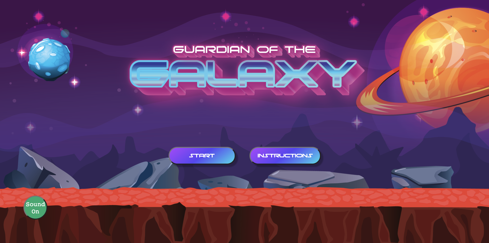

# Guardian of The Galaxy
Game Description
A game that has pop up aliens that require you to kill them by clicking on it to gain points. Has a duration of 30 seconds that takes in a score and stores a high score. The game is inspired from a Japanese arcade name known as "Whac a mole".

## Game Link
<a href="https://faithchan.github.io/guardianofthegalaxy/">Guardian of The Galaxy</a>

## Technologies
* **HTML**
* **CSS**
* **Javascript**
* **Vanilla JS** is used to manage DOM manipulation 
* **Illustrator** is used for part of UI

## Asset Credits
Audio - YouTube & ZapSplat  
Sprite Sheets - Game Developer Studio

## Accomplishments
* Aliens pop out randomly at a random time with an animation
* Include sound effects on clicks to notify of a successful click
* Allow storage of highscore
* Instruction and gameover UI was created with modal pop up
* Allows player to on/off audio as and when
* For players that score highscore, they will be notified through the modal that they have achieved highscore

## Difficulties 
* Getting the modal to pop up when timer hits zero, my placement of the function was not in desired sequence so the modal kept popping up at when the timer is at 1 second.
* Getting the css to display all the elements nicely, had to wrap many elements in a div and style the divs first.
* The codes in my js were getting a little hard to find. I should have stored all the variables in 1 file and work on a split screen with the variables always visible so I know which has been created.

## Game Instructions
* Kill as many Aliens within 30 seconds
* Each kill is 5 points added to scoreboard. Kill as many to reach highscore.

## UI Design and Game flow
1. The landing page has 3 functions, to view instructions of game, turn on audio and prepare for the game start  
 

